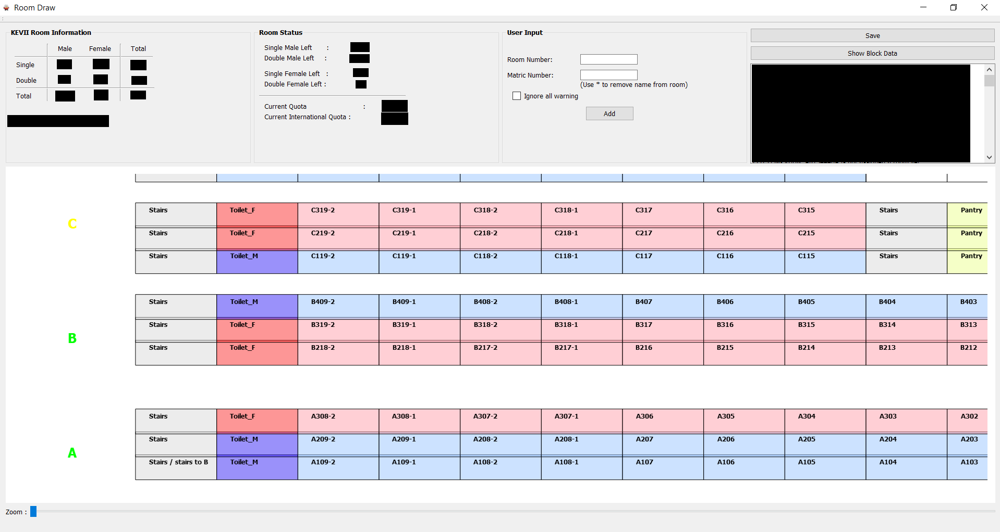

# **KEREX - Internal Administration tool for KEVII Hall**

# Objective  

This tool is highly dependent on ResidentData.csv. Please make sure you have updated the database from time to time. 

---

## 1. Serves as a room draw assisting tool 

### User input's rules by order:  
i. Check if it's a valid room number  
ii. Check if the selected room is occupied  
iii. Check if the matric number is valid (in ResidentData.csv database)  
iv. Check if resident already have a room (Use * in matric number to remove)  
v. Check if the gender is correct  
vi. Check if floor level nationality quota is obeyed  
vii. Check if room type quota is obeyed
viii. Check if senior block quota is obeyed

> The UI box plot coordinates are stored in Floorplan.csv

> If you want to block out a room, insert "NIL" in the RoomData.csv

*Fig 1: User Interface of which room is available based on floor plan*

--- 

## 2.  Quick processing of KE Internal Points Systems (KEIPS). 
> The csv file should be named **exactly** as with the CCA name recorded in CCATier.csv  

> Common error is that some csv files contain ",". To fix this, open the csv file, find all "," and replace with "".

### CCATier.csv  
- Serve as a point checking tool. To ensure no CCA has allocated more points than it was permitted. It generates warning message for manual intervention.

### HallLeader.csv
- Update the matric number of hall leader in this sheet such that when calculating outstanding performance point quota, they can be excluded.

### KEIPSSummary.csv
- To insert the respective data from previous year, so that the room draw points can be stacked.  

--- 

## Dependencies
#### Tested on Ubuntu 16.04 & 18.04, Window 10

- Qt >= v4.0

## Basic Build Instructions

1. Clone this repo
2. Open KEREX.pro with Qt Creator 
3. Build the package

--- 

## Deployment

1. Build the project within Qt and choose the release option
2. Open Qt Console and vavigate to your built directory
3. Remove all files, except the .exe file
4. Run the following command (install windeployqt first)
>*windeployqt.exe --quick .
5. You should have a directory that contain all the library and an executable file. Validate the app by running the .exe file
6. Note that this is a static build and when pass down, the entire folder is required to launch the app