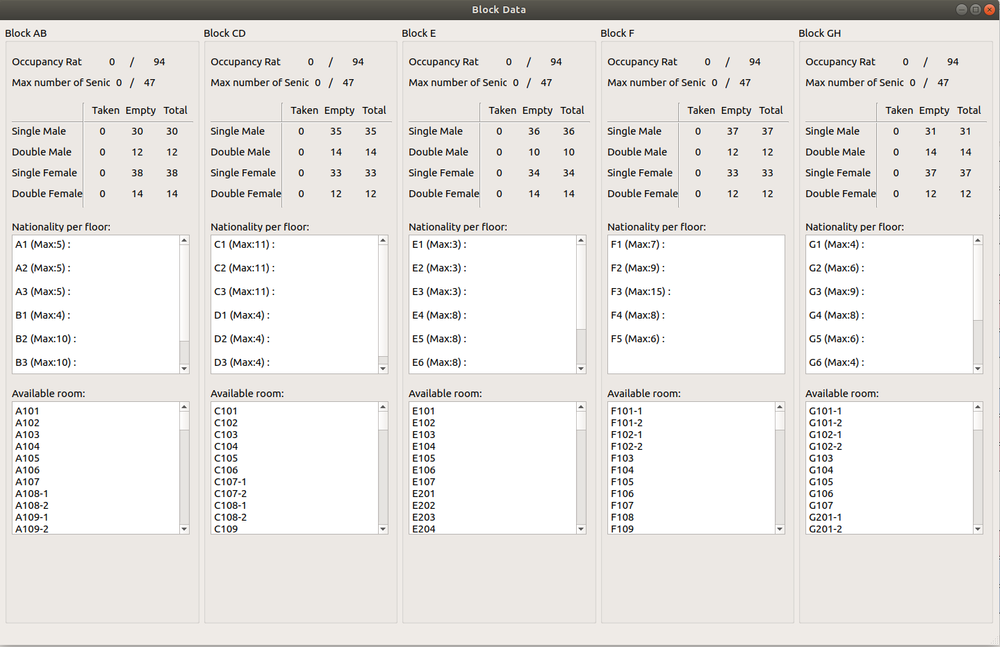

# **KEREX - Internal Administration tool for KEVII Hall**

## Objective
1. [Under development] Serves as a room draw assisting tool - validate resident's information, obey certain rules such as international quoata and visualisation of available rooms for drawing.

*Fig 0: User Interface of which room is available based on floor plan*

*Fig 1: Detailed breakdown of room data*

2. [Under development] Quick processing of KE Internal Points Systems (KEIPS). 

## Dependencies
#### Tested on Ubuntu 16.04 & 18.04

- Qt >= v4.0

## Basic Build Instructions

1. Clone this repo
2. Open KEREX.pro with Qt Creator 
3. Build the package

